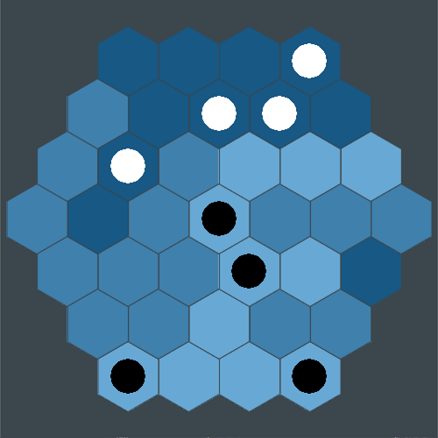
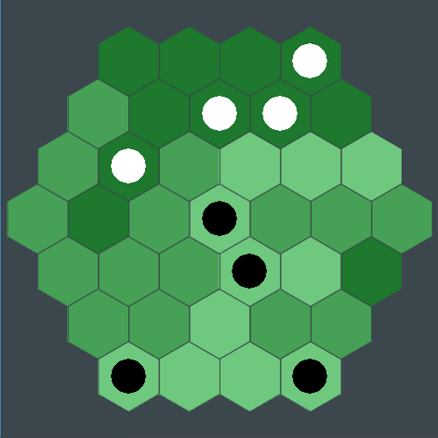

# Hexagonal Iso-Path

HIP is an interesting board game created by youtuber [pocket83](https://www.youtube.com/user/pocket83). Watch [this video](https://www.youtube.com/watch?v=Wz6q03b8R6U) to see his explanation of the game, its rules, and how to make a physical version from scratch. Huge thanks to Red Blob Games for [this tutorial](http://www.redblobgames.com/grids/hexagons) on hex grid coordinate systems, my original approach would have been disgustingly inelegant.

## Dependencies

Requires python 2.7 and pygame

## Usage

Edit `config.py` to change settings, and run `main.py` to play the game. All colors/sizes/fonts are adjustable. At the end of each game a replay is saved to the /replays/ folder. They are named by timestamp so they should stay in order, but I suggest renaming ones that you don't want to lose regardless. To view a replay pass it as an argument to `main.py` (e.g. `python main.py replays/sample.replay`). To control the replay use the left and right arrow keys or space/return and backspace/esc.

# Rules

(all images created by pocket83)   
